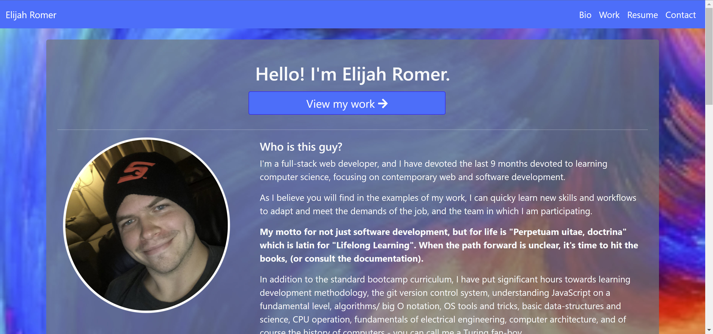

# Elijah Romer's Portfolio Website [")](https://opensource.org/licenses/MIT)
  
  ## Description
  This website was created as a way to showcase my biography, resume, and projects in a customizable and deployed website that can be independently viewed from GitHub or LinkedIn.

### Technologies Used:
* Handlebars
* Express
* Bootstrap
* CSS3

_**Click [HERE](https://elijahromer.herokuapp.com/) to be taken to the deployed website.**_

  
  

  ---
## Table of Contents
  1. [Usage](#usage)
  1. [License](#license)
  1. [Questions](#questions)

  ---
  
  ## Usage
    
This website was designed to be intuitive to use and easy to navigate. The landing page displays my biography and has a conspicuous button at the top that will take you to the work page where various highlighted projects are displayed. 

The top navbar displays quick links to the different relevant parts of the website. 
* Clicking on either my name in the top left, or the bio button on the right side, will take you to the main Biography page (same as the landing page).
* Clicking on the "Work" button will take you to the work page where you can view descriptions, screenshots, and links to my relevant work. 
* Clicking on the "Resume" button will take you to a page with an embedded PDF of my resume that can be viewed right there, as well as a link to download a PDF file of the resume. 
* Clicking on the "Contact" button will take you back to the bio page, but scroll down to the contact information section. 

There are also "Scroll to top" buttons on each page for ease of navigation.

---

## License
  
  This application is licensed under **The Massachusets Institute of Technology License (MIT)**.
  
  Click the license badge below for more information and usage guidelines:
  
  [")](https://opensource.org/licenses/MIT)
  
  Click [here](https://www.mit.edu/~amini/LICENSE.md
  "MIT Full Terms and Conditions") to view the full terms and conditions text of MIT.
  
  ---
  
  ## Questions
  
Please do not hesitate to reach out with any questions you may have. I can be reached in the following ways:

* Email: [ElijahARomer@gmail.com](mailto:ElijahARomer@gmail.com)
* GitHub: [ElijahRomer](http://www.github.com/ElijahRomer)
* LinkedIn: [ElijahRomer](https://www.linkedin.com/in/elijahromer/)

Thank you for reaching out and I look forward to getting in touch with you soon!

